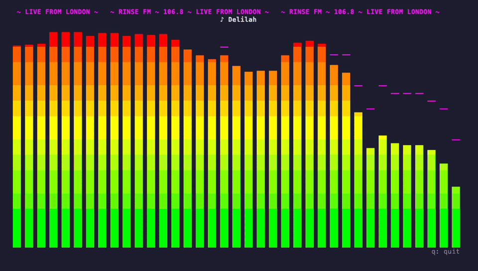

# rinsefm

Stream [Rinse FM](https://www.rinse.fm/) in your terminal, with a live colour
spectrum visualizer and now-playing metadata.



## Install

```bash
brew install keenanjohnson/tap/rinsefm
```

This pulls in `ffmpeg` (which provides `ffplay`) automatically. Then just run
`rinsefm`.

```bash
rinsefm                 # play Rinse FM UK
rinsefm --bars 48       # more spectrum bars
rinsefm --no-audio      # visualizer only
rinsefm --url http://…  # any other Icecast stream
```

Press `q` (or Ctrl-C) to quit.

## Build from source

Requires a Rust toolchain (https://rustup.rs) and `ffmpeg` + `ffplay` on your
PATH (`brew install ffmpeg` / `apt install ffmpeg`).

```bash
cargo build --release
./target/release/rinsefm
```

## How it works

One thread opens a raw HTTP/1.0 connection to the Icecast server with the
`Icy-MetaData: 1` header, so track titles arrive interleaved in the stream
itself. It strips that metadata out and tees the compressed audio bytes to two
child processes: `ffplay` for playback and `ffmpeg` for decoding to PCM. A
second thread chunks the PCM into a channel; the main thread runs an FFT
(Hann window, 2048 samples) mapped onto log-spaced frequency bands from
45 Hz to 16 kHz, and renders with [ratatui](https://ratatui.rs).

